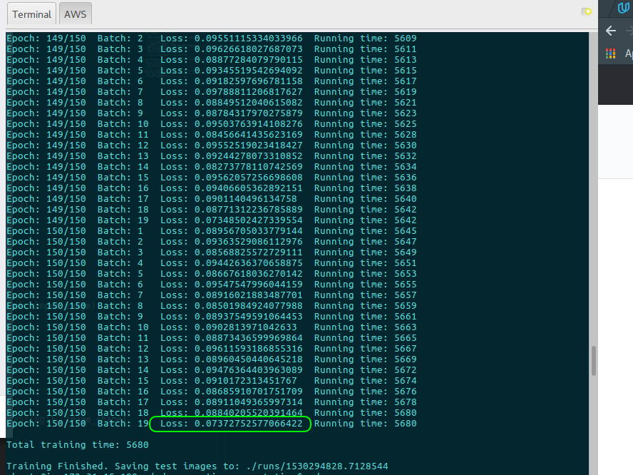

# Semantic Segmentation
Using a Fully Convolutional Network (FCN), road pixels in images from a driver's perspective are identified and marked. For the encoder part of the neural network, a pre-trained version of the `vgg16` network is used and is automatically downloaded when the network training is initiated. See `maybe_download_pretrained_vgg()` function in `helper.py`. The decoder part of this FCN is built up in the `layers()` fuction in `main.py`.


The image above is a sampling of the resultant images with the road pixels identified.

---
### Setup

##### GPU
`main.py` will check to make sure a GPU is used--if you don't have a GPU on your system, you can use AWS or another cloud computing platform.

##### Frameworks and Packages
Make sure you have the following is installed:
 - [Python 3](https://www.python.org/)
 - [TensorFlow](https://www.tensorflow.org/)
 - [NumPy](http://www.numpy.org/)
 - [SciPy](https://www.scipy.org/)

##### Dataset
Download the [Kitti Road dataset](http://www.cvlibs.net/datasets/kitti/eval_road.php) from [here](http://www.cvlibs.net/download.php?file=data_road.zip).  Extract the dataset in the `data` folder.  This will create the folder `data_road` with all the training a test images.

##### Implementation
The network training and inference code reside in the `main.py` and `helper.py` modules. The current network training achieves a total loss value of about 0.074 after training over 150 epochs.




##### Run
To begin the neural network training and to generate the road "painted" images execute the follwoing at a terminal:
```
python main.py
```
 
 ### Tips
- The link for the frozen `VGG16` model is hardcoded into `helper.py`.  The model can be found [here](https://s3-us-west-1.amazonaws.com/udacity-selfdrivingcar/vgg.zip)
- The model is not vanilla `VGG16`, but a fully convolutional version, which already contains the 1x1 convolutions to replace the fully connected layers. Please see this [forum post](https://discussions.udacity.com/t/here-is-some-advice-and-clarifications-about-the-semantic-segmentation-project/403100/8?u=subodh.malgonde) for more information.  A summary of additional points, follow. 
- The original FCN-8s was trained in stages. The authors later uploaded a version that was trained all at once to their GitHub repo.  The version in the GitHub repo has one important difference: The outputs of pooling layers 3 and 4 are scaled before they are fed into the 1x1 convolutions.  As a result, some students have found that the model learns much better with the scaling layers included. The model may not converge substantially faster, but may reach a higher IoU and accuracy. 
- When adding l2-regularization, setting a regularizer in the arguments of the `tf.layers` is not enough. Regularization loss terms must be manually added to your loss function. otherwise regularization is not implemented.


---
#### TODOs
* Augment input images to provide more training examples for the network for better learning.
* Save network model so that it can be retrieved for use in inference prediction without having to rerun the training cycle.
* Apply trained model to a video.
